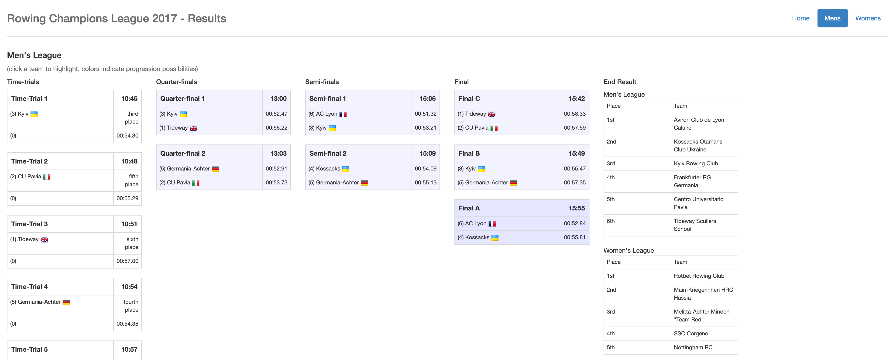

# rowingchampionsleague-results

Interactive live-results app/website for the [Rowing Champions League](http://rowingchampionsleague.com/).



Displays the progression of teams in the KO-racing system throughout the race day. Automatically refreshes so that it can be used for public display (LED wall etc.).

I'm publishing this here as open source so that someone might be able to pick this up/apart for future reuse in KO-style rowing regattas.

## Building

```grunt build```

## Hosting, Live-editing of results

The app can be hosted on most standard shared webspaces (PHP, FTP) by just copying the `dist/` folder over after build.

### Teams only

You can disable display of team members using `http://localhost:9000/#/results/mens?teams=false`

### Admin Mode

There's an admin mode that you can enable by launching the app using the `admin=true` url param like so: `https://${yourUrl}/#/?admin=true`. This allows you to edit the data in place.

Data is persisted in two json files `men.json`and `women.json` for the results page of the respective league. I can't remember the exact setup but I think we used Apache server config to protect write access to these files.
